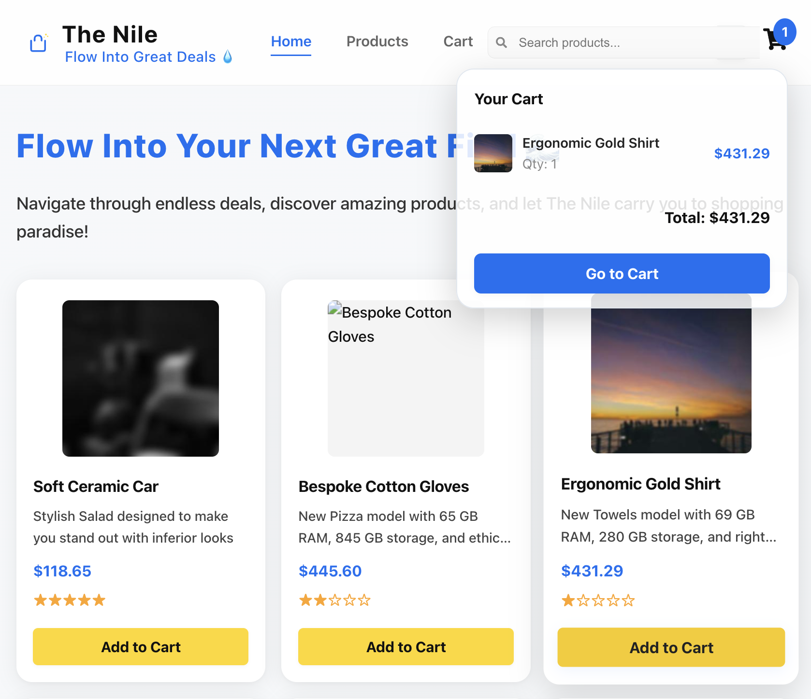

# Mercel Market 🛍️



Discover. Shop. Smile. ✨

Welcome to Mercel Market, a modern Amazon-inspired shopping experience built with React and Vite. Dive into a world of deals, discover unique products, and enjoy a seamless shopping experience!

## Features

- Beautiful, responsive design with mobile-friendly navigation
- Creative branding and engaging UI
- Product grid with dynamic cards
- Shopping cart with popup and animated icon
- Fast, modern tech stack (React + Vite + styled-components)

## Getting Started

1. **Install dependencies:**
   ```bash
   npm install
   ```
2. **Run the development server:**
   ```bash
   npm run dev
   ```
3. **Open your browser:**
   Visit [http://localhost:5173](http://localhost:5173) to explore Mercel Market.

## Project Structure

- `src/components/` – UI components (Header, ProductCard, Cart, etc.)
- `src/pages/` – Main pages (Home, NotFound, etc.)
- `src/assets/` – Product data and images

## Customization

You can easily update products, styles, and branding to make Mercel Market your own.

---

Built with ❤️ using React, Vite, and styled-components.
